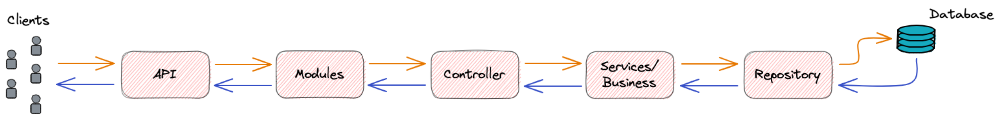
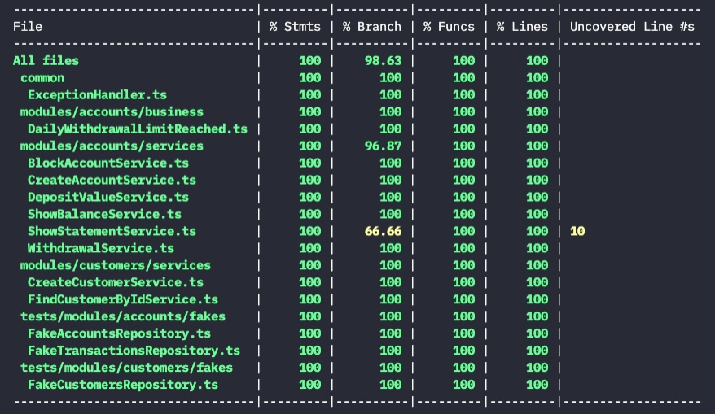

## REST API Challenge

## 🛠 Ferramentas necessárias
- Docker
- Docker Compose
- Node
- NPM
- MAKE - opcional

## ✅ Inicializando o projeto
O preenchimento do arquivo `.env` é opcional, caso não exista ou não esteja
preenchido o arquivo `config.ts` já terá consigo os valores default.

Caso precise, utilizando o comando abaixo no terminal copiará o `.env.example`
para `.env`
> cat .env.example > .env

Se estiver utilizando o Make, esteja com o terminal aberto na pasta raíz do
repositório e digite `make`, assim ele irá subir um container do **MariaDB**.

Uma vez que o container estiver no ar, basta executar escolher entre
```
make up
# Ele irá executar todas as migrations, e executar o ambiente de desenvolvimento

make build
# Ele irá executar toads as migrations, buildar e inicializar a aplicação
```

Se não estiver com o Make, basta executar os comandos abaixo
```
docker-compose up -d
npm run install

# Ambiente de desenvolvimento:
npm run dev

# Ambiente com o build
npm run build
node dist/server.js
```
OBS: Importante, o container do banco de dados precisa de um tempo para criar o
ambiente, se tentar executar as migrations antes do banco ficar pronto ele irá
disparar um erro de **PROTOCOL_CONNECTION_LOST**.

## 🧱 Arquitetura da aplicação
O app irá fornecer uma porta de entrada para API. Em seguida, é percebido que
a partir do módulo bate no controller que por sua vez chama os serviços, e por
fim atinge os repositórios necessários para expor os recursos desejados pelo
usuário.

Se tudo ocorrer bem, os recursos passam por toda aplicação novamente fazendo o
caminho inverso até atingir o cliente final.


## 🧪 Testes unitários
Os testes foram aplicado na camada de Services onde reside a maior parte da
lógica de negócio, e, corre maior risco de quebrar a aplicação em casos de
melhoria ou refatoração.


## Endpoints disponíveis
Caso esteja utilizando o [Insomnia](https://insomnia.rest/) como Client de teste
para API, basta importar o arquivo `Endpoints-Insomnia.json`.

Customers:
- **POST** - Criar usuário   - `http://localhost:3333/api/v1/customers`
  - body `{ "nome": "John Doe", "cpf": "12345678900", "dataNascimento": "10/10/1990" }`
- **GET**  - Mostrar usuário - `http://localhost:3333/api/v1/customers/{id}`

Accounts:
- **POST**  - Criar uma conta - `http://localhost:3333/api/v1/accounts`
  - body: `{ "idPessoa": 1, "tipoConta": 1, "limiteSaqueDiario": 1000 }`
- **GET**   - Saldo da conta - `http://localhost:3333/api/v1/accounts/{id}/balance`
- **PATCH** - Deposito na conta - `http://localhost:3333/api/v1/accounts/{id}/deposit`
  - body: `{ "valor": 1500 }`
- **PATCH** - Saque na conta - `http://localhost:3333/api/v1/accounts/{id}/withdrawal`
  - body: `{ "valor": 300 }`
- **PATCH** - Bloqueio da conta - `http://localhost:3333/api/v1/accounts/{id}/block`

Transactions:
- **GET** - Extrato no intervalo de 1 mês - `http://localhost:3333/api/v1/accounts/{id}/statements`
  - query param: `date=2021-11-20`
